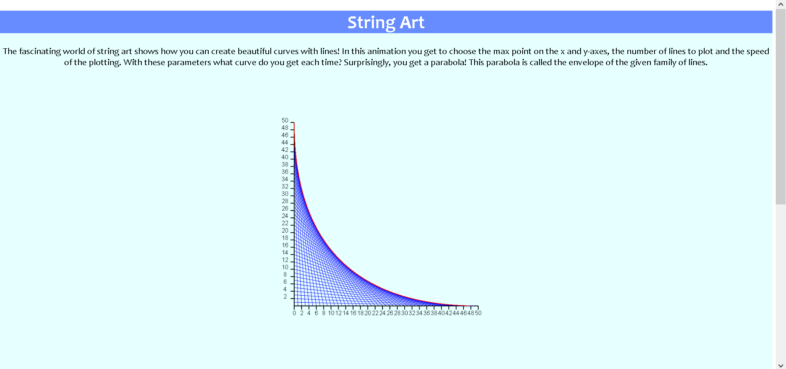

# String Art Animation Webpage

## Html, CSS and Javascript working together to create a fun and interactive animation.
This repository contains Javascript code that draws a family of lines and the envelope given by a parabolic curve.  

A user can choose the max value on the x-axis, y-axis, the number of lines to draw and how fast they want to see the animation run!  

## The code needs:
The code uses html5 canvas to draw two dimensional graphics.  The axes and tick marks are all created from scratch.

## The functions involved
There is one main function involved which is the draw function that animates the lines being drawn as well as the parabola that fits to the lines.  The other supplementary functions are clearCanvas, TickLineX, TickLineY, strokeLine, and parabola.  These are used to draw the tick lines, axes and the parabolic curve. Within the code we also have event listeners to be able to track which values the sliders are changed to and when the button is clicked that updates the animation. 

## Mathematical questions

The mathematics behind this code involves finding the envelope of a family of lines.  The parabola was calculated by finding intersection points between a finite set of lines and then taking the limit of these with respect to a parameter specifiying the distance between each pair of lines and letting that go to zero.

